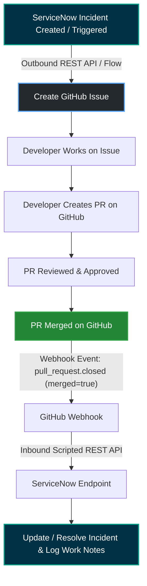

# Bidirectional ServiceNow & GitHub Integration

A robust, bidirectional integration between **ServiceNow ITSM** and **GitHub** that bridges Incident Management and software development workflows. When an incident is logged in ServiceNow, a corresponding GitHub Issue is automatically created. Once developers implement the fix, submit a Pull Request, and merge it into the target branch, a GitHub Webhook notifies ServiceNow to automatically resolve the incident with relevant commit and PR detail.

---

## 📌 Architecture & Workflow



---

## 🔄 End-to-End Workflow Breakdown

| Step | Action | Platform | Description |
| :--- | :--- | :--- | :--- |
| **1** | **ServiceNow Incident** | ServiceNow | Incident is created or assigned to the engineering queue (e.g., category: `Software / Bug`). |
| **2** | **Create GitHub Issue** | GitHub | A ServiceNow Business Rule or Flow triggers an outbound REST API call to GitHub to create an issue referencing the Incident ID (`INCxxxxxxx`). |
| **3** | **Development** | GitHub | A developer picks up the GitHub issue, creates a feature/fix branch, and writes code. |
| **4** | **Create Pull Request** | GitHub | Developer opens a PR referencing the issue (e.g., `Fixes #42 - Addresses INC0010023`). |
| **5** | **Review & Approval** | GitHub | Team reviews the PR and required checks pass. |
| **6** | **PR Merged** | GitHub | PR is merged into the base branch (`main` / `master` / `release`). |
| **7** | **GitHub Webhook** | GitHub | GitHub emits a `pull_request` event (`action: closed`, `merged: true`) to the ServiceNow webhook listener. |
| **8** | **Receive Webhook** | ServiceNow | ServiceNow Scripted REST API receives and verifies the webhook payload using the HMAC SHA-256 secret. |
| **9** | **Update Incident** | ServiceNow | The matching Incident is located and automatically updated (e.g., State set to **Resolved**, Resolution Code: **Solved (Permanently)**, Work Notes updated with PR link & commit SHA). |

---

## 🚀 Key Features

- **Automated Issue Tracking**: Removes manual copying of incident details into GitHub.
- **Traceability**: Direct cross-referencing between ServiceNow Incident Number (`INCxxxxxxx`) and GitHub Issue / PR URLs.
- **Real-Time Automated Resolution**: Incidents are immediately transitioned upon successful PR merge.
- **Secure Integration**: Supports HMAC SHA-256 signature verification (`X-Hub-Signature-256`) to validate GitHub payloads.
- **Customizable State Mapping**: Configure custom status transitions and resolution codes to fit your team's ITIL process.

---

## 🛠️ Prerequisites

- **ServiceNow Instance**: Admin privileges on a ServiceNow instance (PDI or Enterprise).
- **GitHub Repository**: Admin access to configure Webhooks and Personal Access Tokens / GitHub App.
- **Network Reachability**: If using a ServiceNow Personal Developer Instance (PDI), ensure it can receive public incoming webhooks, or use a tool like [ngrok](https://ngrok.com) / webhook relay for local testing.

---

## ⚙️ Setup & Configuration

### Part 1: ServiceNow to GitHub (Outbound)

#### 1. Generate GitHub Personal Access Token (PAT)
1. Go to **GitHub** > **Settings** > **Developer settings** > **Personal access tokens** (Tokens classic or Fine-grained).
2. Grant repository permissions:
   - `issues: write` (to create and manage issues).
3. Copy and save the generated token securely.

#### 2. Create Outbound REST Message in ServiceNow
1. Navigate to **System Web Services** > **Outbound** > **REST Message**.
2. Click **New**:
   - **Name**: `GitHub REST API`
   - **Endpoint**: `https://api.github.com/repos/{owner}/{repo}`
   - **Authentication**: Set an HTTP Header:
     - Header: `Authorization`
     - Value: `Bearer <YOUR_GITHUB_TOKEN>`
     - Header: `Accept`
     - Value: `application/vnd.github+json`
3. Add an **HTTP Method**:
   - **Name**: `Create Issue`
   - **HTTP Method**: `POST`
   - **Endpoint**: `https://api.github.com/repos/${owner}/${repo}/issues`
   - **HTTP Query Parameters**: (Optional)
   - **Content**:
     ```json
     {
       "title": "${title}",
       "body": "${body}",
       "labels": ["servicenow", "incident"]
     }
     ```

#### 3. Trigger via Business Rule or Flow Designer
Create an **after Insert** Business Rule on the `incident` table:

```javascript
(function executeRule(current, previous /*null when async*/) {
    // Condition check (e.g. category is Software or specific assignment group)
    if (current.category == 'Software' || current.assignment_group.getDisplayValue() == 'Engineering') {
        try {
            var restMessage = new sn_ws.RESTMessageV2('GitHub REST API', 'Create Issue');
            restMessage.setStringParameterNoEscape('owner', 'YOUR_GITHUB_ORG_OR_USER');
            restMessage.setStringParameterNoEscape('repo', 'YOUR_REPOSITORY_NAME');
            restMessage.setStringParameterNoEscape('title', current.number + ': ' + current.short_description);
            restMessage.setStringParameterNoEscape('body', 
                "### ServiceNow Incident Information\n" +
                "- **Incident Number:** " + current.number + "\n" +
                "- **Priority:** " + current.priority.getDisplayValue() + "\n" +
                "- **Description:**\n" + current.description + "\n\n" +
                "_Created automatically via ServiceNow Integration._"
            );

            var response = restMessage.execute();
            var responseBody = response.getBody();
            var httpStatus = response.getStatusCode();

            if (httpStatus == 201) {
                var json = JSON.parse(responseBody);
                current.work_notes = "GitHub Issue created: " + json.html_url;
                // Optional: Store GitHub Issue number in a custom field (e.g. u_github_issue_id)
                current.correlation_id = json.number.toString();
                current.update();
            } else {
                gs.error("Failed to create GitHub Issue. HTTP Status: " + httpStatus + ", Response: " + responseBody);
            }
        } catch (ex) {
            gs.error("Error creating GitHub Issue: " + ex.getMessage());
        }
    }
})(current, previous);
```

---

### Part 2: GitHub to ServiceNow (Inbound Webhook)

#### 1. Create Scripted REST API in ServiceNow
1. Navigate to **System Web Services** > **Scripted Web Services** > **Scripted REST APIs**.
2. Click **New**:
   - **Name**: `GitHub Webhook Receiver`
   - **API ID**: `github_webhook_receiver`
3. Under **Resources**, click **New**:
   - **Name**: `Receive Event`
   - **HTTP Method**: `POST`
   - **Relative path**: `/payload`
   - **Requires authentication**: `false` (GitHub authenticates via HMAC signature)
4. Add the **Script**:

```javascript
(function process(/*RESTAPIRequest*/ request, /*RESTAPIResponse*/ response) {
    var payloadString = request.body.dataString;
    var eventType = request.getHeader('X-GitHub-Event');
    var signature = request.getHeader('X-Hub-Signature-256');
    var webhookSecret = gs.getProperty('github.webhook.secret'); // Stored in sys_properties

    // Optional: Validate HMAC SHA-256 signature using GlideCertificate / Crypto
    // (Recommended for production instances)

    if (eventType !== 'pull_request') {
        response.setStatus(200);
        response.setBody({ message: "Ignored event type: " + eventType });
        return;
    }

    var body = JSON.parse(payloadString);
    var action = body.action;
    var pr = body.pull_request;

    // Check if the PR was closed and merged
    if (action === 'closed' && pr && pr.merged === true) {
        var prBody = pr.body || "";
        var prTitle = pr.title || "";
        var prUrl = pr.html_url;
        var mergeCommitSha = pr.merge_commit_sha || "";

        // Regex pattern to extract incident number (e.g., INC0010001)
        var incPattern = /(INC\d{7,10})/i;
        var match = incPattern.exec(prTitle) || incPattern.exec(prBody);

        if (match && match[1]) {
            var incNumber = match[1].toUpperCase();

            var incGr = new GlideRecord('incident');
            incGr.addQuery('number', incNumber);
            incGr.query();

            if (incGr.next()) {
                // Update State to Resolved (State 6 in standard OOB ServiceNow)
                incGr.incident_state = 6;
                incGr.state = 6;
                incGr.close_code = 'Solved (Permanently)';
                incGr.close_notes = "Resolved via GitHub Pull Request: " + prUrl + " (Commit: " + mergeCommitSha + ")";
                incGr.work_notes = "PR merged into " + pr.base.ref + ". Closing Incident via GitHub Webhook.";
                incGr.update();

                gs.info("Successfully updated and resolved incident " + incNumber + " from GitHub PR merge.");

                response.setStatus(200);
                response.setBody({ status: "success", incident: incNumber, updated: true });
                return;
            } else {
                gs.warn("Incident " + incNumber + " mentioned in PR but not found in ServiceNow.");
            }
        }
    }

    response.setStatus(200);
    response.setBody({ status: "acknowledged", details: "No incident resolved" });
})(request, response);
```

#### 2. Configure GitHub Webhook
1. Go to your **GitHub Repository** > **Settings** > **Webhooks** > **Add webhook**.
2. **Payload URL**: `https://<YOUR_SERVICENOW_INSTANCE>.service-now.com/api/<NAMESPACE>/github_webhook_receiver/payload`
3. **Content type**: `application/json`
4. **Secret**: Enter your predefined webhook secret key.
5. **Which events would you like to trigger this webhook?**:
   - Select **Let me select individual events** -> Check **Pull requests**.
6. Check **Active** and click **Add webhook**.

---

## 🔒 Security Best Practices

1. **HMAC Signature Verification**: Always verify the `X-Hub-Signature-256` header against the payload using the shared secret to prevent spoofed webhook requests.
2. **Store Secrets in System Properties**: Never hardcode tokens or webhook secrets in scripts. Store them in ServiceNow System Properties (`sys_properties`) with restricted read access or using the **Credentials** module.
3. **Least Privilege**: Configure the GitHub Personal Access Token or GitHub App with only the minimal permissions required (`issues:write`).

---

## 🧪 Testing the Integration

1. **Step 1**: Create a new Incident in ServiceNow with category `Software`.
2. **Step 2**: Verify a new GitHub Issue is created in your repository with the incident title and details.
3. **Step 3**: In GitHub, create a branch, push commits, and open a Pull Request mentioning the incident (e.g. `Fixes INC0010001: Resolve memory leak`).
4. **Step 4**: Approve and **Merge** the Pull Request.
5. **Step 5**: Check GitHub **Webhook Deliveries** (under Repo Settings > Webhooks > Recent Deliveries) to verify a `200 OK` response.
6. **Step 6**: Refresh the ServiceNow Incident to verify the state has changed to **Resolved** and work notes contain the PR link and merge commit.

---

## 📄 License

This project is licensed under the [MIT License](LICENSE).
